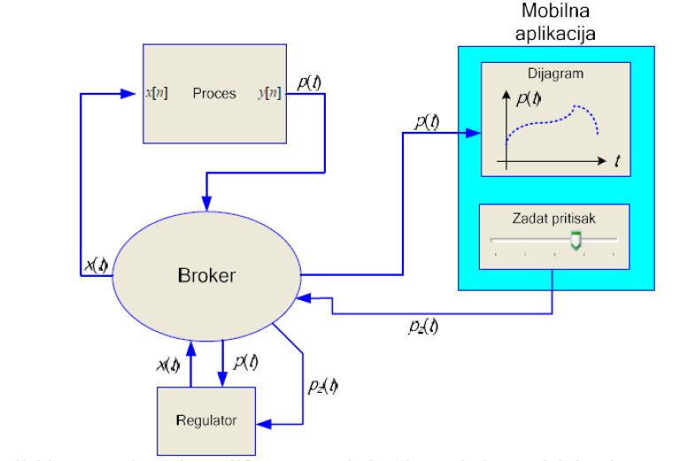
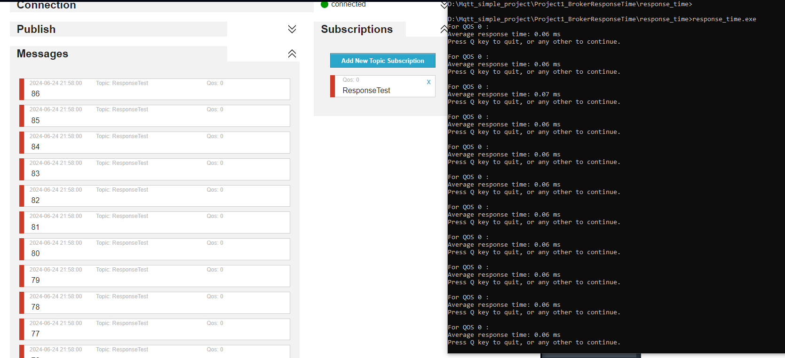
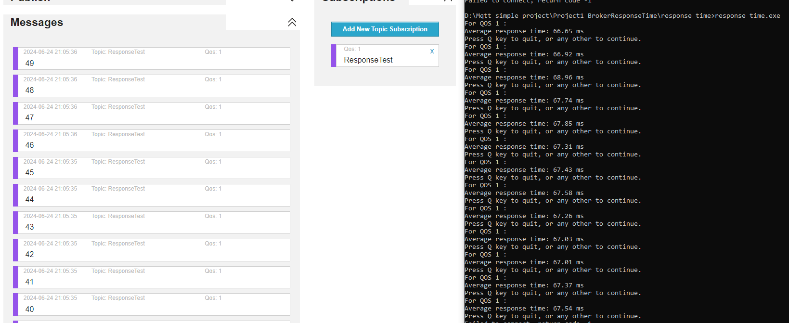
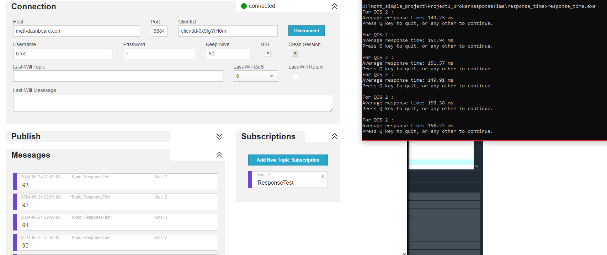

# Mqtt_simple_project

Co-Author: Uros Popovic, github: https://github.com/urospopovic1996

Additional resources: time control. The task consists of two parts.
To control timing within a C program, one of the standard libraries contained in time.h is used. The library should be included with #include <time.h> in the program.

## Part 1 - Response time of broker
Write a program that tests the average response time of a broker:
 - Implement a client program that subscribes to a topic and continuously publishes test messages of arbitrary but varying content to the same topic, for example, numbers from 0 to 255.
 - Immediately before sending the first message to the topic, start a timer.
 - As soon as the client receives the 100th message back from the broker, stop the timer and record the time interval.
 - Divide the time interval by 100 to obtain the average response time.
 - Repeat steps 3 and 4 in an infinite loop.
 - Print the average response time on the screen, one below the other, after each measurement cycle.
 - Implement any command to exit the program.
 - Evaluate the average response time and deviation from the average time for all QOS types.
 
## Part 2 - Simulate a industry process
Choose QoS for minimum fluctuation in average response time. The average response time is labeled Tp
The system simulating pressure control in an industrial process is depicted in the following image:



a) The industrial process is described by a differential equation modeling a first-order system with a time constant of 10s and gain of 1:
\[ y[n] = \frac{1}{21} \left( x[n] + x[n-1] \right) + \frac{19}{21} y[n-1] \]
Here, \( y[n] \) represents the pressure \( p(t) \) in relative units [0-100%]. Sampling of \( y[n] \) based on the input signal occurs with a period \( T_s = 1 \)s (using a timer). All initial values for the differential equation are 0. Whenever a new value of \( p(t) \) is generated, it is written to the corresponding topic. A mobile application subscribes to this topic and graphs the pressure values every second whenever a new \( y[n] \) is received. Additionally, the mobile application generates the desired pressure \( p_z(t) \) via a slider ranging from 10 to 90, which is written to another corresponding topic.

b) The controller subscribes to topics for current pressure \( p(t) \) (received every second) and desired pressure \( p_z(t) \) (received when the slider is adjusted). The controller implements hysteresis ON-OFF control such that if the current pressure \( p(t) \) exceeds \( p_z(t) \) by deltaP, it writes 0 to the appropriate topic. If \( p(t) \) is less than \( p_z(t) \) by deltaP, it writes 100 to the topic. If within bounds, nothing is written. The industrial processes subscribe to this topic, receiving either 0 or 100 from the broker, which is then stored in \( x_{temp} \). At each sampling instance \( T_s \), \( x[n] \) is set to \( x_{temp} \).

c) Run the simulation for deltaP = 5. Document the regulation quality for several slider positions: 10, 40, 60, 80. Repeat for deltaP = 1.

## Project requirements:
**Integrated Computer Systems 2, project 7b**

Write a program that enables synchronous reading of a 3D accelerometer and 3D gyroscope using the X-NUCLEO-IKS01A2 sensor board. The acquired data needs to be transmitted via a serial connection to a computer and graphically displayed on an OLED display.

# Report 
## How to set up
### Software
 - Clone repo:
```
   git clone --recurse-submodules https://github.com/UrosCvjetinovic/Mqtt_simple_project.git
```
 - Environment:
```
   Embarcadero_Dev-Cpp_6.3_TDM-GCC_9.2_Setup
```
 - Set up broker with configured topic (see source code):
```
   https://www.hivemq.com/demos/websocket-client/
```
 
## Implementation 

### Part 1 - Response time of broker

#### Logic

#### Testing

##### QOS 0
Average response time: 0.06-0.07 ms


 

##### QOS 1
Average response time: 67-68 ms


 

##### QOS 2
Average response time: 149-151 ms


 
 
### Part 2 - Simulate a industry process

#### Logic

#### Testing